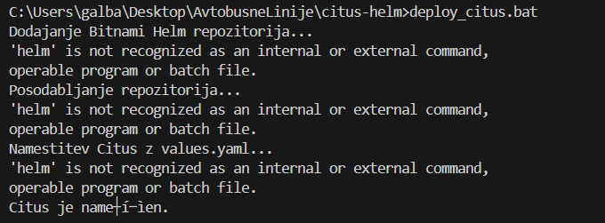

# AvtobusneLinije
# 1. del:
 - naloga v javi

# 2. del: 
- Omogočimo Kubernetes v Dockerju:  
    
  

- Naložimo Minikube z .exe datoteko in preverimo, ali je uspešno naloženo ter verzijo:  
  

- Dodamo Minikube v PATH:  
  

- Zaženemo Minikube:  
  

- Lokalno odpremo dashboard:  
  

/*- zazenemo deploy_citus.bat datoteko:*/
  

- nalozimo citrus in preverimo pods:
  