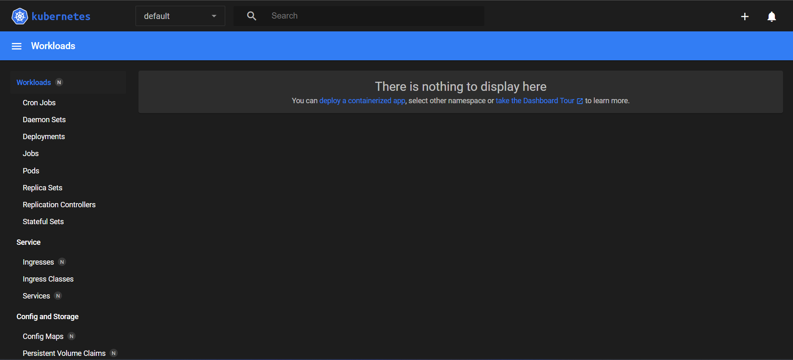

# AvtobusneLinije
# 1. del:
 - naloga v javi

# 2. del: 
- Omogočimo Kubernetes v Dockerju:  
    
  

- Naložimo Minikube z .exe datoteko in preverimo, ali je uspešno naloženo ter verzijo:  
  

- Dodamo Minikube v PATH:  
  

- Zaženemo Minikube:  
  

- Lokalno odpremo dashboard:  
  

- Nalozimo Helm:  
  

- Nalozimo citrus in preverimo pods:  
  

- komande:  
    - minikube start         # ustvari lokalni cluster
    - kubectl get nodes      # preveri ali node teče
    - helm install citus .   # namesti Citus (ali drugo aplikacijo)
